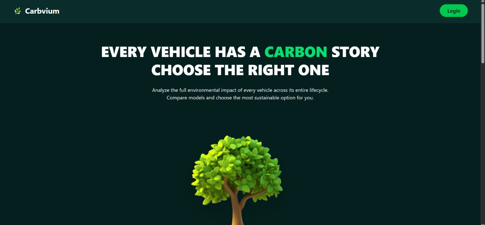
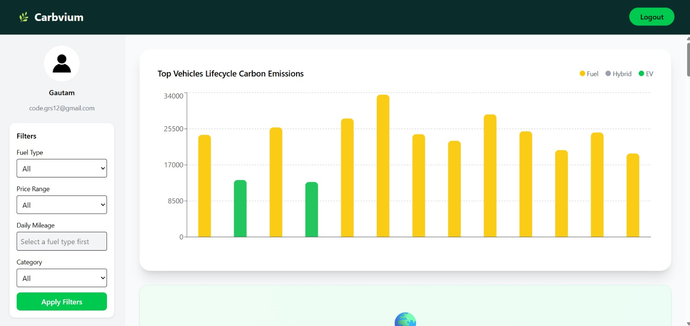
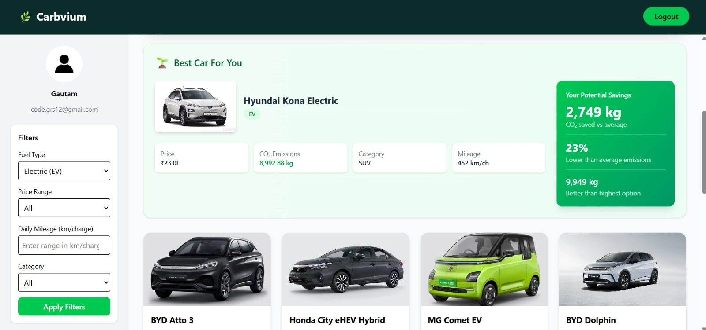
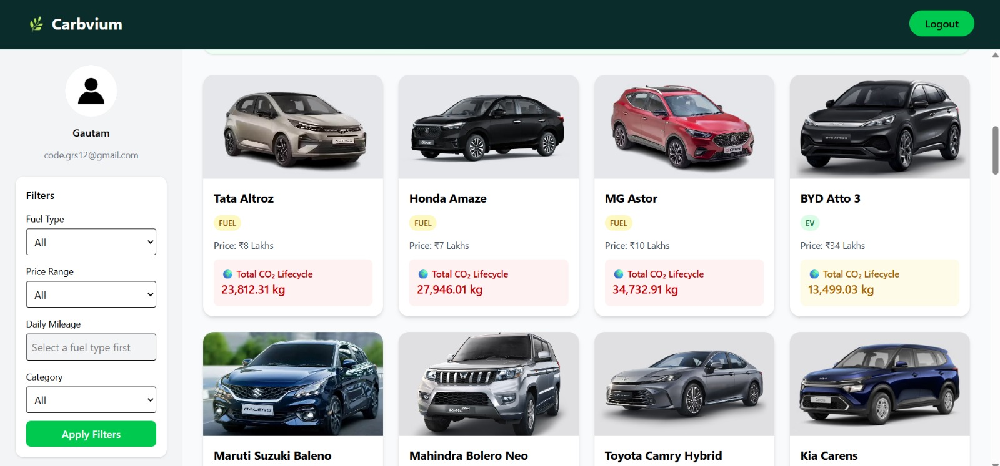
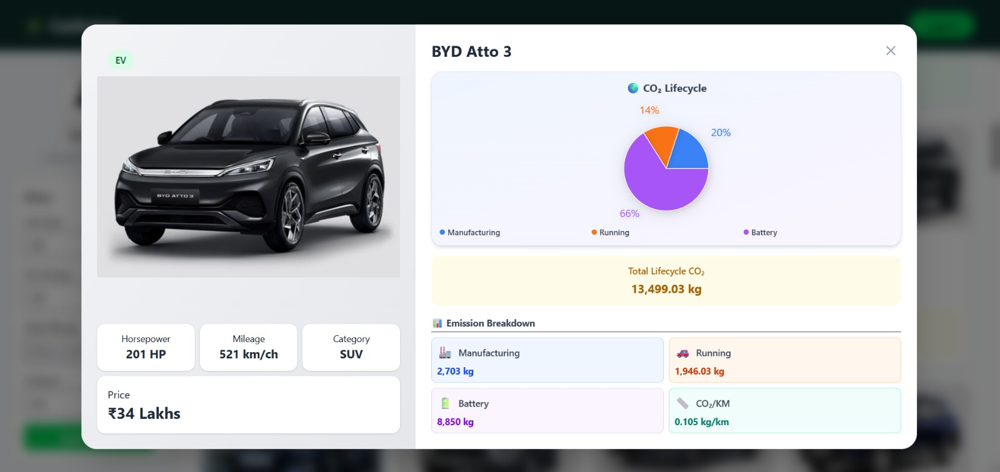

# 🌿 Carbvium

> **Every vehicle has a carbon story — choose the right one.**

Carbvium is a web application that helps users analyze and compare the full lifecycle carbon emissions of vehicles. Make informed, sustainable choices for your next vehicle purchase.


---

## ✨ Features

- **🔍 Vehicle Comparison** - Compare carbon footprints across multiple vehicle models side-by-side
- **📊 Visual Charts** - Interactive lifecycle emission charts and breakdowns (manufacturing, running, battery)
- **🎯 Smart Filters** - Filter by fuel type, price range, mileage, and vehicle category
- **✅ Best Car Recommendations** - Get the most eco-friendly vehicle suggestion based on your criteria
- **📈 CO₂ Savings Calculator** - See potential carbon savings compared to average vehicles
- **🔐 User Authentication** - Secure login/signup with Supabase

---

## 🛠️ Tech Stack

### Frontend
- **React 19** - UI library
- **Vite** - Build tool
- **Tailwind CSS 4** - Styling
- **Framer Motion** - Animations
- **Recharts** - Data visualization
- **React Router** - Navigation

### Backend
- **Node.js** - Runtime
- **Express 5** - Web framework
- **Supabase** - Database & Authentication
- **PostgreSQL** - Database (via Supabase)

### DevOps
- **Docker** - Containerization
- **Nginx** - Production web server

---

## 📁 Project Structure

```
Carbvium/
├── Carbvium_Backend/       # Express.js API server
│   ├── server.js           # Main server entry
│   ├── auth.js             # Authentication routes
│   ├── supabase_client.js  # Supabase configuration
│   ├── Dockerfile
│   └── package.json
│
├── Carbvium_Frontend/      # React application
│   ├── src/
│   │   ├── pages/          # Page components
│   │   │   ├── landing.jsx
│   │   │   ├── login.jsx
│   │   │   ├── dashboard.jsx
│   │   │   └── card.jsx
│   │   ├── assets/         # Images and static files
│   │   ├── App.jsx
│   │   └── main.jsx
│   ├── Dockerfile
│   ├── nginx.conf
│   └── package.json
│
├── docker-compose.yml      # Docker orchestration
├── README.md
└── LICENSE
```

---

## 🚀 Getting Started

### Prerequisites

- **Node.js** >= 20.x
- **npm** >= 10.x
- **Docker** & **Docker Compose** (for containerized deployment)
- **Supabase account** (for database)

---

## 📦 Installation

### Option 1: Local Development

#### 1. Clone the repository
```bash
git clone https://github.com/yourusername/Carbvium.git
cd Carbvium
```

#### 2. Setup Backend
```bash
cd Carbvium_Backend

# Install dependencies
npm install

# Create environment file
cp .env.example .env

# Edit .env with your Supabase credentials
# SUPABASE_URL=your_supabase_url
# SUPABASE_SERVICE_ROLE_KEY=your_service_role_key
# SUPABASE_ANON_KEY=your_anon_key

# Start development server
npm run dev
```

#### 3. Setup Frontend (in a new terminal)
```bash
cd Carbvium_Frontend

# Install dependencies
npm install

# Start development server
npm run dev
```

#### 4. Access the application
- **Frontend:** http://localhost:5173
- **Backend API:** http://localhost:5000

---

### Option 2: Docker Deployment

#### 1. Clone and configure
```bash
git clone https://github.com/yourusername/Carbvium.git
cd Carbvium

# Create backend environment file
cp Carbvium_Backend/.env.example Carbvium_Backend/.env
# Edit with your Supabase credentials
```

#### 2. Build and run with Docker Compose
```bash
# Build and start all services
docker-compose up --build

# Or run in detached mode
docker-compose up --build -d
```

#### 3. Access the application
- **Frontend:** http://localhost (port 80)
- **Backend API:** http://localhost:5000

#### Docker Commands
```bash
# Stop all services
docker-compose down

# View logs
docker-compose logs -f

# Rebuild specific service
docker-compose up --build frontend
docker-compose up --build backend
```

---

## 🔧 Environment Variables

### Backend (`Carbvium_Backend/.env`)
```env
SUPABASE_URL=your_supabase_project_url
SUPABASE_SERVICE_ROLE_KEY=your_supabase_service_role_key
SUPABASE_ANON_KEY=your_supabase_anon_key
PORT=5000
NODE_ENV=development
```

### Frontend (`Carbvium_Frontend/.env`)
```env
VITE_API_URL=http://localhost:5000
```

---

## 🔌 API Endpoints

| Method | Endpoint | Description |
|--------|----------|-------------|
| GET | `/api/vehicles` | Get all vehicles |
| GET | `/api/top15-carbon` | Get top 15 vehicles by CO₂ |
| GET | `/api/top15-carbon/filtered` | Get filtered vehicles |
| POST | `/auth/signup` | User registration |
| POST | `/auth/login` | User login |

---

## 🖼️ Screenshots

### Landing Page
The landing page introduces users to Carbvium with key features and benefits.



### Dashboard
Interactive dashboard with filters, charts, and vehicle recommendations.







### Vehicle Cards
Detailed vehicle cards showing lifecycle CO₂ breakdown with pie charts.



---

## 🤝 Contributing

1. Fork the repository
2. Create your feature branch (`git checkout -b feature/AmazingFeature`)
3. Commit your changes (`git commit -m 'Add some AmazingFeature'`)
4. Push to the branch (`git push origin feature/AmazingFeature`)
5. Open a Pull Request

---

## 📄 License

This project is licensed under the GNU General Public License v3.0 - see the [LICENSE](LICENSE) file for details.

---

## 👥 Authors

- **Manas Tiwari** - *Devops/Database/Backend Dev*
- **Akhilesh Singh** - *UI/UX & Frontend/Backend Dev*
- **Gautam Raj Singh** - *Frontend & Backend Dev*

---

## 🙏 Acknowledgments

- Vehicle data sourced from various automotive databases
- Icons from React Icons
- UI inspiration from modern eco-friendly applications

---


